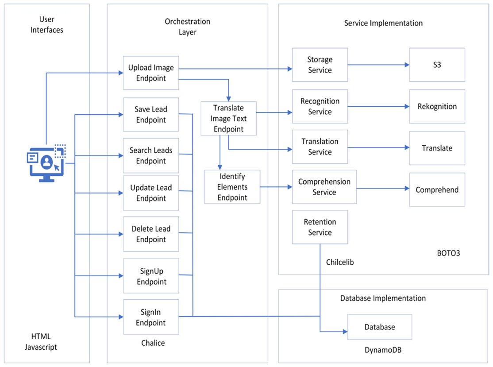
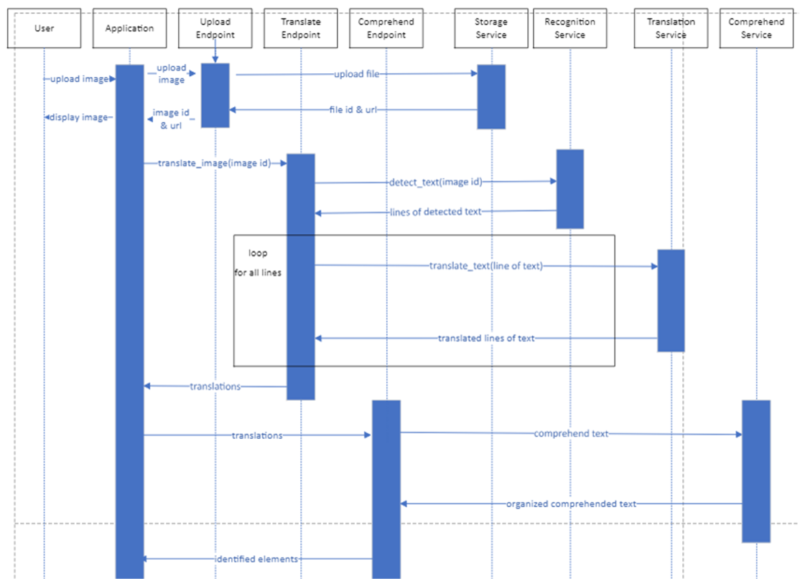
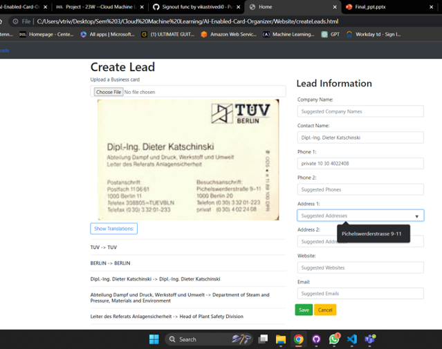
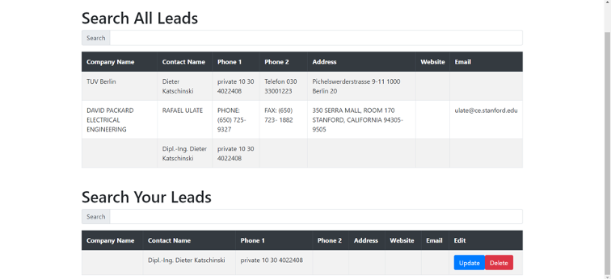

# AI-Enabled-Card-Organizer
AI Enabled Card Organizer - Group Project for COMP264

### Setup AWS CLI using the following command on Terminal 
```
aws configure
```

### To remove 'Pipfile' and 'Pipfile.lock', run the following commands on Terminal 
```
pipenv --rm
rm Pipfile*
```

### To setup 'pipenv' with all the requirements, run the following commands on Terminal 
```
pipenv --three
pipenv install -r requirements.txt
```

### To run chalice local server, run the following commands on Terminal 
```
pipenv shell
cd Capabilities
chalice local
```

### Architecture Diagram


### Communications Diagram


### Business Card Detection and Translation


### Lead Search Table

